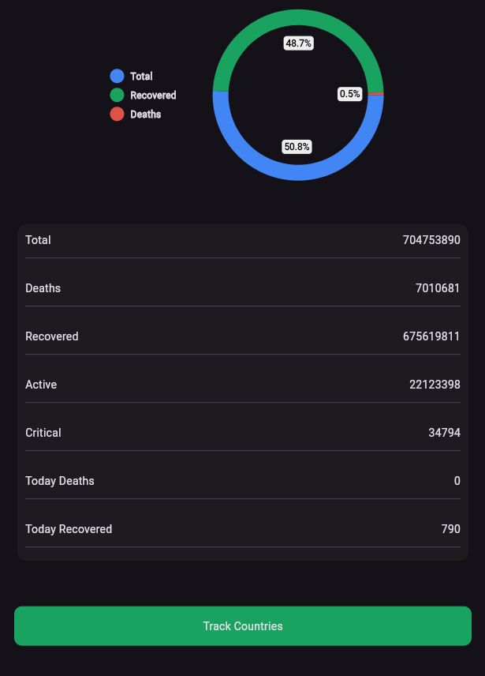

# 🔴 COVID-19 Tracker App


A comprehensive mobile application built with **Flutter** to track real-time COVID-19 statistics worldwide. This app provides up-to-date data on total cases, deaths, recovered patients, and active cases globally and for specific countries.

---

## 📸 Screenshots

| Splash Screen | World Statistics | Country List | Detail View |
|:---:|:---:|:---:|:---:|
|  |  |  |  |

---

## ✨ Features

- **Real-time Data:** Fetches live data from a public REST API.
- **Global Dashboard:** Displays worldwide total cases, deaths, recovered, and active cases.
- **Visualizations:** Interactive pie charts to represent data visually.
- **Country-wise Tracking:** List of all affected countries with their specific flags and stats.
- **Search Functionality:** Filter countries instantly by name.
- **Responsive Design:** Optimized for various screen sizes.
- **Splash Screen:** Animated intro with `SpinKit`.

---

## 🛠️ Tech Stack & Packages Used

- **Framework:** [Flutter](https://flutter.dev/)
- **Language:** Dart
- **State Management:** `setState` (or Provider/Bloc if you used them)
- **Networking:** `http`
- **Design:** `google_fonts`, `flutter_spinkit`, `pie_chart`
- **Architecture:** MVVM (Model-View-ViewModel)

---

## 🚀 Getting Started

Follow these steps to run the project locally.

### Prerequisites
- Flutter SDK installed ([Guide](https://flutter.dev/docs/get-started/install))
- Dart SDK
- Android Studio or VS Code

### Installation

1. **Clone the repository**
   ```bash
   git clone [https://github.com/lachhmansingh16/Covid-19-Tracker-App](https://github.com/lachhmansingh16/Covid-19-Tracker-App)